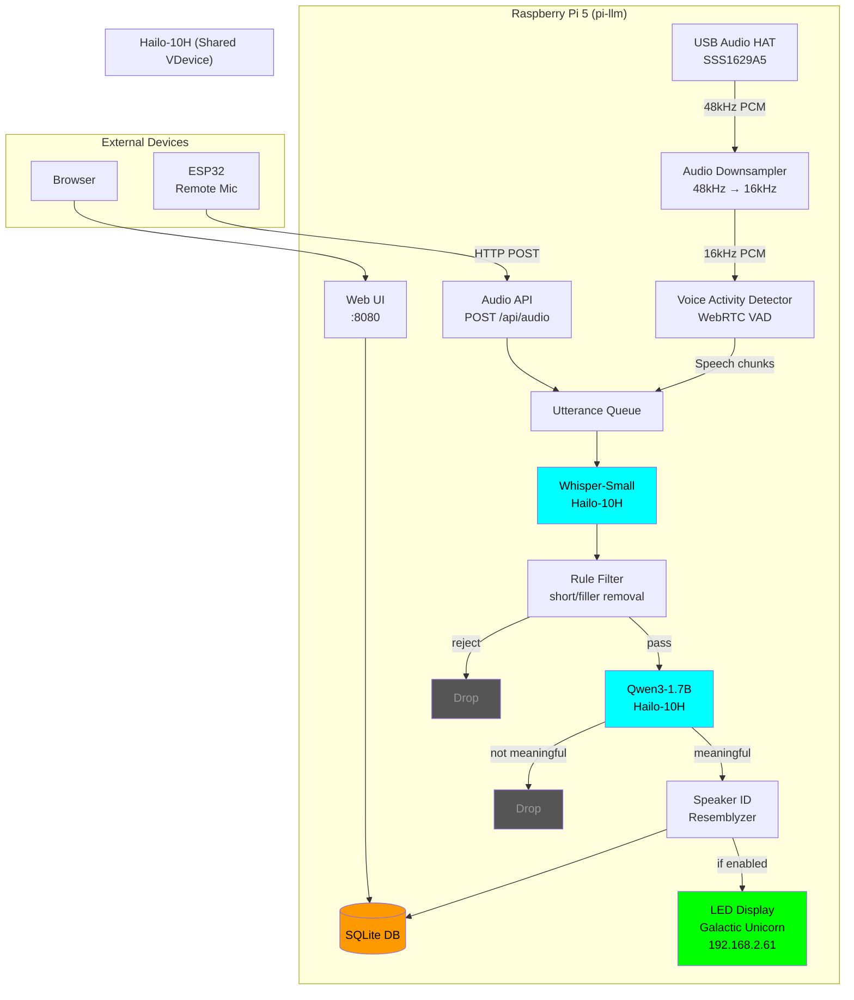
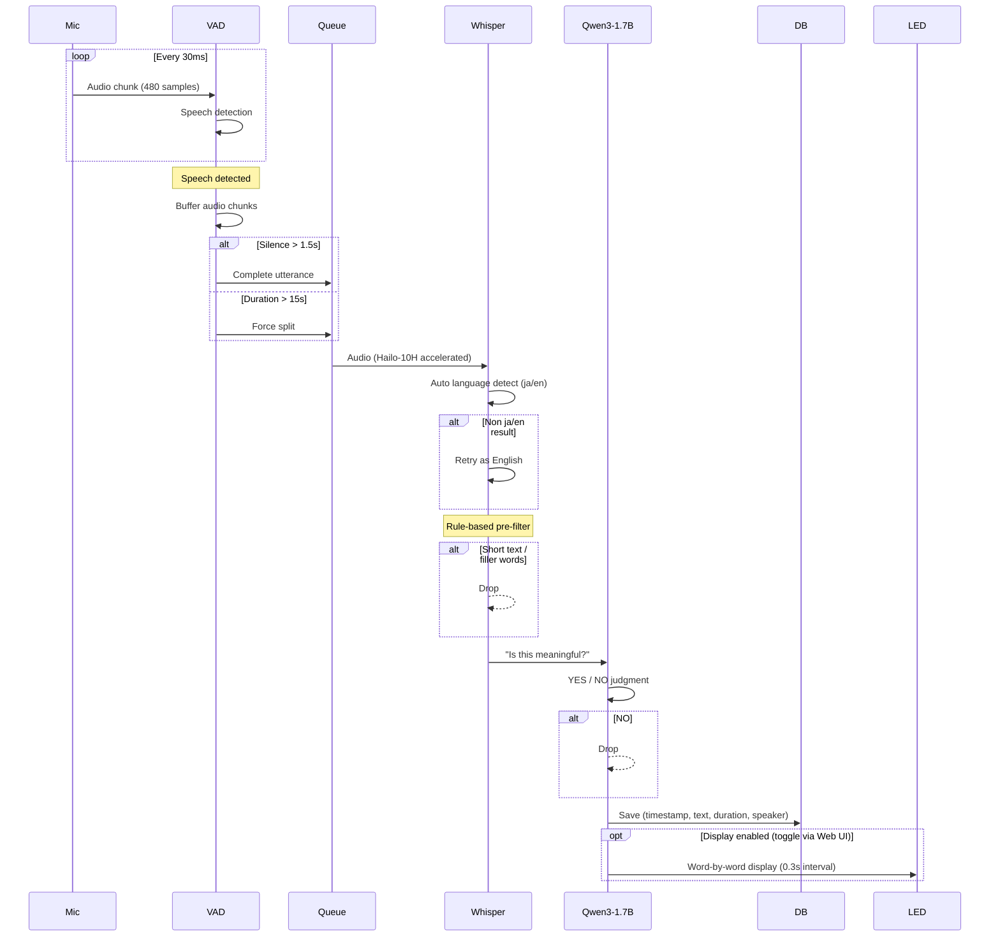

# Pi News Researcher

Raspberry Pi 5 + Hailo-10H AI accelerator を使った常時音声認識システム。
認識結果をLLMでフィルタリングしてSQLiteに保存し、電光掲示板（Galactic Unicorn）にリアルタイム表示。

## System Architecture



## Processing Pipeline



## Hardware Requirements

| Component | Model | Role |
|-----------|-------|------|
| SBC | Raspberry Pi 5 (16GB) | Host |
| AI Accelerator | Hailo-10H (AI HAT+, 8GB) | Whisper + LLM inference |
| Audio | USB Audio HAT (SSS1629A5) | Microphone input |
| Display | Galactic Unicorn (RPi Pico) | LED text display |
| Remote Mic (optional) | ESP32 + I2S mic | Remote audio input |

## Software Stack

| Component | Version | Role |
|-----------|---------|------|
| HailoRT | 5.3.0 | AI runtime |
| Whisper-Small | 386MB HEF | Speech-to-text |
| Qwen3-1.7B-Instruct | 2.7GB HEF | Content filter (meaningful speech detection) |
| Resemblyzer | 0.1.4 | Speaker identification |
| WebRTC VAD | 2.0.10 | Voice activity detection |
| SQLite | built-in | Transcription database |

Both Whisper-Small and Qwen3-1.7B run on the same Hailo-10H using shared VDevice.

## Setup

### 1. Prerequisites

```bash
# HailoRT 5.3.0 must be installed with PCIe driver loaded
hailortcli fw-control identify
# Should show: Firmware Version: 5.3.0

# Models
ls /usr/local/hailo/resources/models/hailo10h/Whisper-Small.hef
ls /usr/local/hailo/resources/models/hailo10h/Qwen3-1.7B-Instruct.hef
```

### 2. Install Dependencies

```bash
cd /home/kota/hailo-apps
source venv_hailo_apps/bin/activate
pip install sounddevice webrtcvad resemblyzer
```

### 3. Clone Repository

```bash
cd /home/kota
git clone git@github.com:kotamorishi/pi-news-researcher.git
```

### 4. Audio HAT Setup

- Connect the USB Audio HAT (SSS1629A5) via Type-C cable to RPi USB port
- **DIP switch: Mic must be ON**
- Verify: `arecord -l` should show "USB PnP Audio Device"

### 5. Register Speaker (Optional)

```bash
# Stop the service first if running
sudo systemctl stop hailo-whisper-display

# Record 10 seconds of your voice
cd /home/kota/hailo-apps
source venv_hailo_apps/bin/activate
python /home/kota/pi-news-researcher/register_speaker.py <name>

# Restart the service
sudo systemctl start hailo-whisper-display
```

### 6. Install systemd Service

```bash
sudo tee /etc/systemd/system/hailo-whisper-display.service > /dev/null << 'EOF'
[Unit]
Description=Hailo Whisper Speech Recognition → LED Display
After=network.target

[Service]
Type=notify
User=kota
WorkingDirectory=/home/kota/hailo-apps
ExecStart=/home/kota/hailo-apps/venv_hailo_apps/bin/python /home/kota/pi-news-researcher/whisper_display.py
Restart=always
RestartSec=5
WatchdogSec=60
Environment=PYTHONUNBUFFERED=1
NotifyAccess=all

[Install]
WantedBy=multi-user.target
EOF

sudo systemctl daemon-reload
sudo systemctl enable hailo-whisper-display
sudo systemctl start hailo-whisper-display
```

## Usage

### Web UI

Open http://192.168.2.55:8080 in your browser.

- View real-time transcription logs with timestamps and speaker labels
- Filter by date using the dropdown
- Toggle LED display output with the "Display" button (default: OFF)
- Auto-refreshes every 5 seconds

### API Endpoints

| Method | Path | Description |
|--------|------|-------------|
| GET | `/` | Web UI |
| GET | `/api/logs?date=2026-04-06&limit=200` | Get transcription logs (JSON) |
| GET | `/api/dates` | Get available dates with entry counts |
| POST | `/api/audio` | Submit audio for transcription |
| POST | `/api/display/toggle` | Toggle LED display on/off |
| GET | `/api/display/status` | Get LED display status |

### Remote Audio (ESP32)

Send audio from remote microphones via HTTP:

```bash
curl -X POST http://192.168.2.55:8080/api/audio \
  -H "Content-Type: audio/wav" \
  -H "X-Source: esp32-kitchen" \
  --data-binary @recording.wav
```

Accepts WAV (any sample rate/channels, auto-converted) or raw PCM (16kHz, 16-bit, mono).

### Logs

```bash
# Real-time log
journalctl -u hailo-whisper-display -f

# Today's log
journalctl -u hailo-whisper-display --since today
```

## Content Filtering

Transcriptions pass through two filter stages before being saved:

### 1. Rule-based filter (instant)
- Text 3 characters or shorter
- Known filler patterns: `...`, `So,`, `Yeah.`, `OK.`, `Uh,`, `Um,`

### 2. LLM filter (Qwen3-1.7B on Hailo-10H)
- Asks the model: "Is this a meaningful sentence worth logging?"
- Drops fragments, noise artifacts, and incomplete phrases
- Runs on the same Hailo-10H as Whisper via shared VDevice

## Database Schema

```sql
CREATE TABLE transcriptions (
    id INTEGER PRIMARY KEY AUTOINCREMENT,
    timestamp TEXT NOT NULL,
    text TEXT NOT NULL,
    duration_sec REAL,
    speaker TEXT
);

CREATE TABLE daily_summaries (
    id INTEGER PRIMARY KEY AUTOINCREMENT,
    date TEXT UNIQUE NOT NULL,
    summary TEXT NOT NULL,
    total_entries INTEGER,
    total_duration_sec REAL
);
```

## OpenAI-Compatible API Server

A separate server (`openai_server.py`) provides OpenAI-compatible `/v1/chat/completions` endpoint using Hailo VLM (Qwen3-VL-2B-Instruct). Supports both text and image inputs.

```bash
# Stop whisper service first, then start VLM server
sudo systemctl stop hailo-whisper-display
sudo systemctl start hailo-openai

# Text request
curl http://192.168.2.55:8000/v1/chat/completions \
  -H "Content-Type: application/json" \
  -d '{"model":"qwen3-vl-2b","messages":[{"role":"user","content":"Hello"}]}'
```

> Note: VLM server uses a different model (Qwen3-VL-2B) that requires exclusive VDevice access. Stop the whisper service before starting the VLM server.
